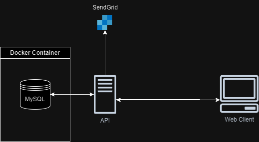

# About

BYou is an online marketplace where people can sell their handmade objects. The main objective of this project was to better accommodate myself with SpringBoot and the development of REST APIs. I also wanted to learn about SendGrid.

# Technologies used

I used React for the Front-end and Java SpringBoot for the Back-end. In addition, I make API calls to SendGrid to get notified whenever someone wants to buy something from you.

